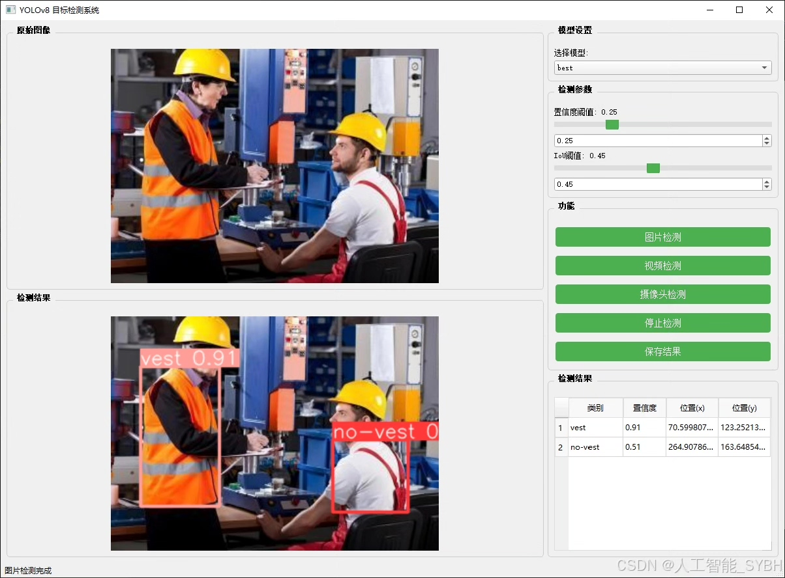
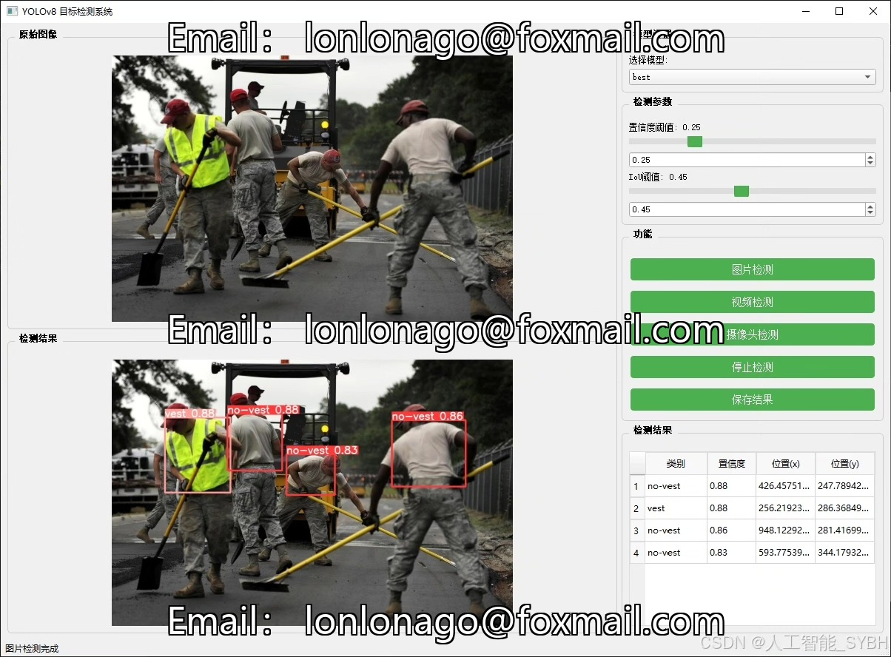
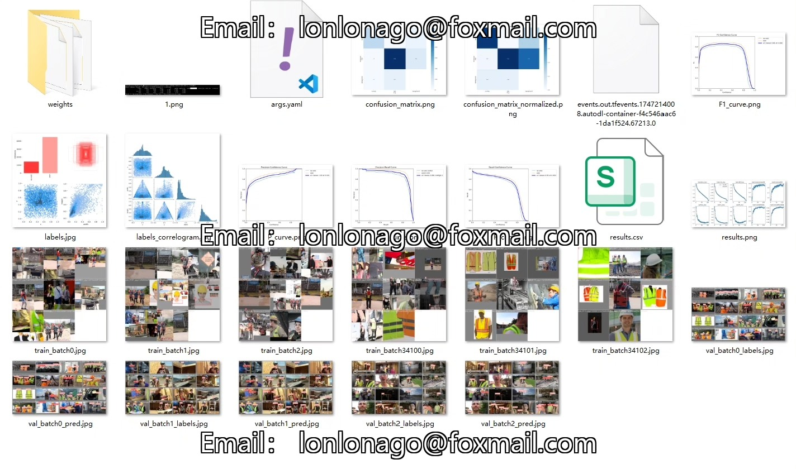
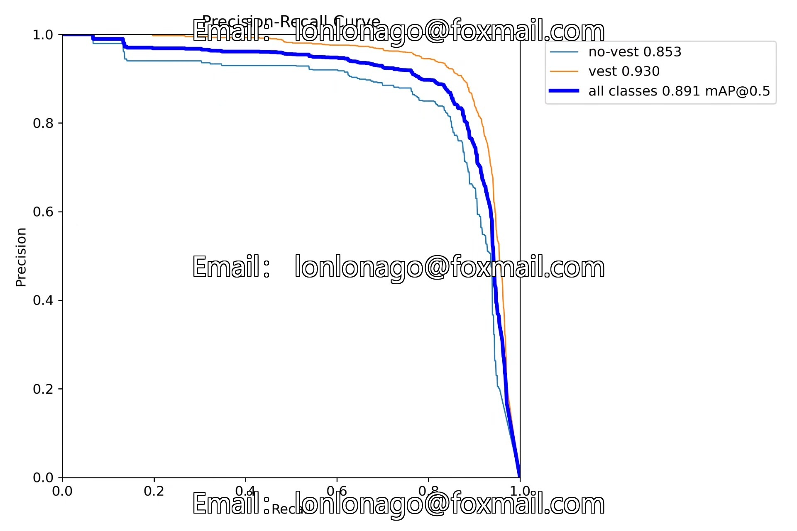
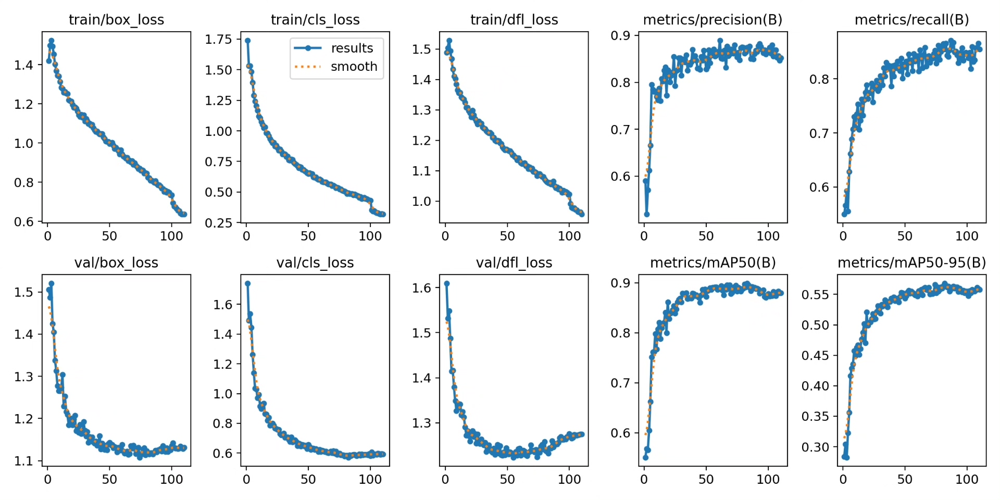
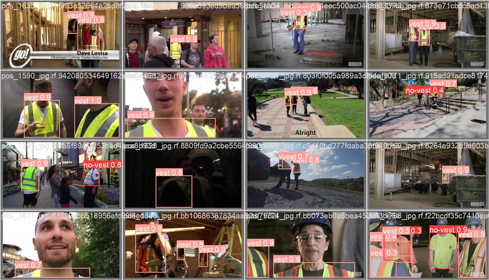
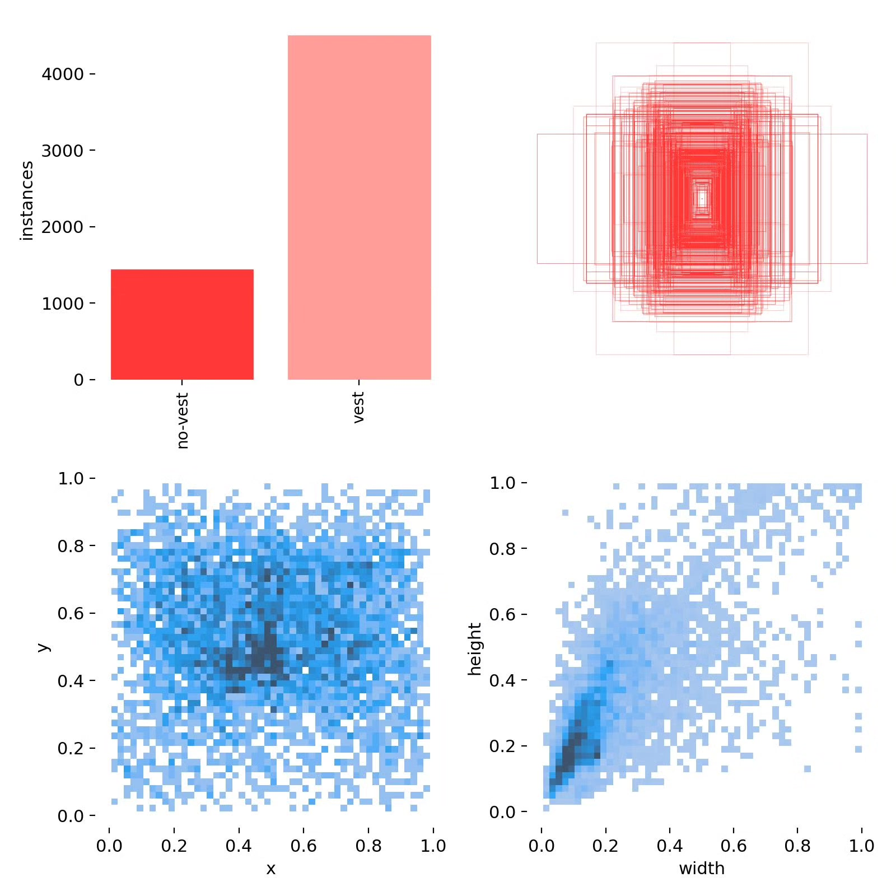
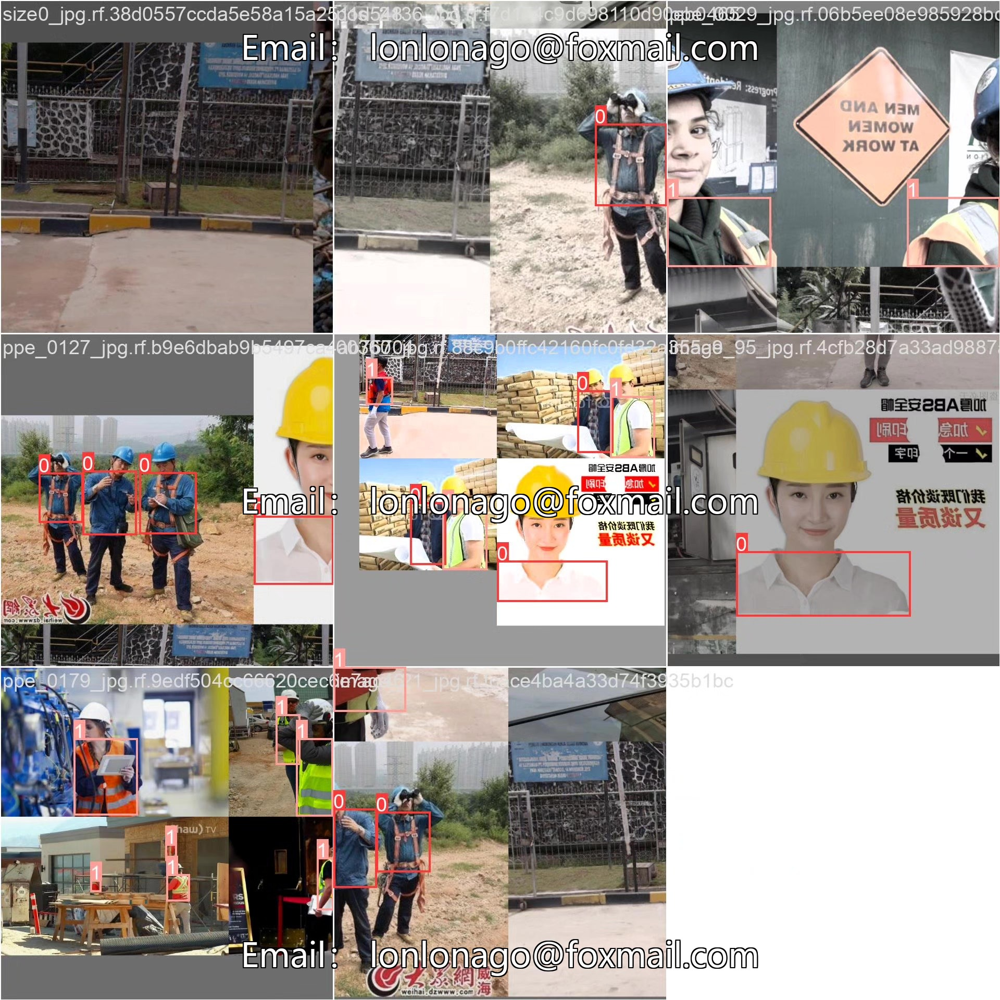

# Based on deep learning YOLOv8, a security vest wearing recognition detection system for safety vests (YOLO)

## Body

Based on the YOLOv8 object detection algorithm, this project has developed a safety vest wearing recognition and detection system. It is specifically designed to identify whether workers are wearing safety vests as required. The system utilizes deep learning techniques to accurately detect and classify "wearing a safety vest" (vest) and "not wearing a safety vest" (no-vest) through real-time analysis of surveillance video streams or static images. The project has built a dataset containing 3897 images (2728 training set, 779 validation set, and 390 test set). After model training and optimization, it has achieved high-precision safety vest recognition capabilities. This system can be widely applied in hazardous work environments such as construction sites, mining areas, power maintenance, road construction, etc., providing intelligent technical support for safe production management and effectively reducing the risk of safety accidents caused by unprotected equipment not being worn.

The company's products have obtained the official commercial license certification from YOLO.

We provide after-sales service.

After payment, we will provide WeChat ID for any questions you may have.

Environmental configuration: We will provide an instruction manual for setting up the environment. If you need remote configuration, an additional fee of 69 is charged, with all fees refunded if the configuration fails (only refund installation fees for older computers).

Retraining the dataset: Once the environment is configured, you can train on your own computer. If you need us to retrain, just pay 69 plus the computing cost (2.5 yuan/hour).

Full after-sales service

## Images

## Payment

Here is a pay link on Stripe ( https://buy.stripe.com/3cs8yP7sY87d0vu9AB ). Please contact me lonlonago@foxmail.com after funding $89, and I will send you a complete data files , thank you!

